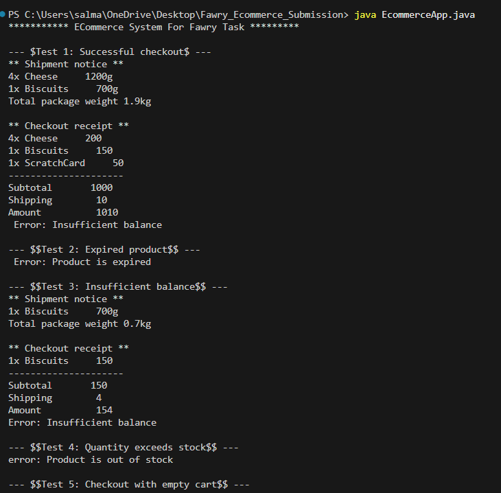

# E-Commerce Java Console App

## Features
- Product management: name, price, quantity, expiration, shipping weight.
- Cart functionality with quantity checks.
- Full checkout process with receipt and shipping details.
- Handles expired products, insufficient balance, and empty carts.

## Prerequisites
- Java Development Kit (JDK) 11 or higher must be installed and available in your system PATH.
  - [Download JDK](https://adoptium.net/) (or from Oracle/OpenJDK)
- Confirm installation by running `java -version` and `javac -version` in your terminal.

## How to Run

1. **Navigate to the project directory:**
   ```bash
   cd Fawry_Ecommerce_Submission
   ```
2. **Compile all Java files:**
   ```bash
   javac -cp . *.java model/*.java cart/*.java service/*.java user/*.java
   ```
3. **Run the application:**
   ```bash
   java -cp . ECommerceApp
   ```

## Notes
- All code was written manually and covers the expected use cases with test scenarios in `main()`.
- If you encounter any issues, ensure your JDK is properly installed and your terminal is in the correct directory.

## Example Output

Below is a screenshot of the application running sample test cases:


    

    